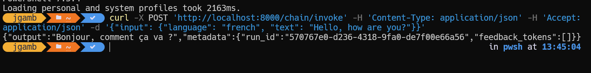
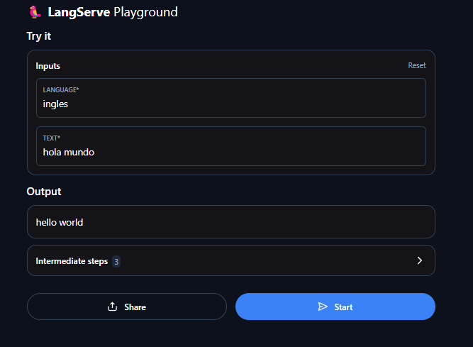

# LLM Chain Tutorial - Aplicación de Traducción con LangChain

Este proyecto es un ejemplo de una aplicación de traducción basada en IA que utiliza LangChain y OpenAI. Proporciona una API REST para traducir texto a diferentes idiomas.

## 🚀 Características

- Traducción de texto a múltiples idiomas
- API RESTful con FastAPI
- Integración con modelos de OpenAI
- Interfaz de documentación interactiva (Swagger UI)

## 📋 Requisitos Previos

- Python 3.8 o superior
- Una clave de API de OpenAI
- pip (gestor de paquetes de Python)

## 🛠️ Instalación

1. Clona el repositorio:

   ```bash
   git clone https://github.com/tu-usuario/arep-taller-LLM-Chain-Tutorial.git
   cd arep-taller-LLM-Chain-Tutorial
   ```

2. Crea un entorno virtual (recomendado):

   ```bash
   python -m venv venv
   source venv/bin/activate  # En Windows: .\venv\Scripts\activate
   ```

3. Instala las dependencias:

   ```bash
   pip install -r requirements.txt
   ```

4. Crea un archivo `.env` en la raíz del proyecto y agrega tu clave de API de OpenAI:
   ```
   OPENAI_API_KEY=tu_clave_aqui
   ```

## 🚀 Uso

### Ejecutar el servidor localmente

Para iniciar el servidor de desarrollo:

```bash
uvicorn server:app --reload
```

El servidor estará disponible en `http://localhost:8000/playground/`

### Documentación de la API

Una vez que el servidor esté en ejecución, puedes acceder a:

- Documentación interactiva: `http://localhost:8000/docs`
- Documentación alternativa: `http://localhost:8000/redoc`

### Ejemplo de solicitud

Puedes probar la API con `curl`:

```bash
curl -X 'POST' \
  'http://localhost:8000/chain/invoke' \
  -H 'Content-Type: application/json' \
  -d '{
    "input": {
      "language": "french",
      "text": "Hello, how are you?"
    }
  }'
```

## 📚 Evidencia





## 📁 Estructura del Proyecto

- `server.py` - El servidor principal que contiene la lógica de la aplicación y la configuración de la API.
- `SimpleLLMApplication.ipynb` - Un cuaderno de Jupyter con ejemplos de cómo usar la cadena de traducción.
- `requirements.txt` - Lista de dependencias de Python necesarias para el proyecto.
- `.env` - Archivo para variables de entorno (no incluido en el repositorio, debe crearse localmente).
- `.gitignore` - Especifica qué archivos deben ser ignorados por Git.

